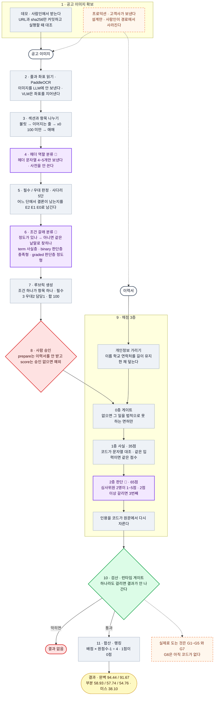

# candidate-job-matching-engine

---

# 한문장
- 채용공고 이미지 한 장에서 지원자 랭킹까지 가는데 모든 점수가 '공고 그림의 어느 좌표에서 나온 조건인가'와 '이력서 원문의 어느구간을 근거로 삼았는가'까지 되짚어준다.

# 목차
1. [공고 이미지 확보](#1-공고-이미지-확보)

# 전체 흐름

전체 흐름 그림:



# 1 공고 이미지 확보

사람인에서 api가 비영리목적이라도 개인에게 승인이 나지 않는다고 한다.. 그래서  대신 API를 어떤 역할로 쓸 것인지 공고 이미지를 어떤 경로로 확보하는것이 좋을지에 대한 방안을 적었다.

API로 크롤링해서 확보와 내용이 이미지인 광고를 API만으로는 사람인 API구조 예시를 봤을 때 이미지를 가져올 수 없을것같았습니다.

1. job-search 호출 -> 목록 + url : API
2. 그 url의 html을 받는다 : 스크래핑
3. html에서 를 찾는다 : 파싱
4. CDN에서 이미지를 내려받는다 : 다운로드

프로덕션에서는 사람인이 경로에서 사라진다.
- 공고 이미지의 원본은 처음부터 고객사에 있을 것이다. 그래서 고객사가 만들어 사람인에 업로드한 것이고, 사람인은 받아서 게시를 했다고 생각했다. 그래서 고객사가 자기 원본을 우리에게 보내면 사람인이 경로에서 통째로 빠진다. 다만 API자체를 사용할 수 있다.
- API 사용
  - 본문을 나르는 파이프에서 검증 장치로 역할을 바꿔봤다.
    1. 동일성확인 (맞는 회사의 공고인가)
    2. 공고 수정 감시 (리비전 관리, 수정되면 루브릭 승인 및 이후 랭킹자체가 무효)
    3. 다만 experience-level 같은 조건성 필드는 읽지 않는다. 그 필드가 요구조건 텍스트 그자체라 대조에만 써도 원문이 들어간것이라고 판단했다.

그래서 현재 상태는 이용 신청이 반려되어 access key를 발급받지 못했고 위 대조 기능은 코드에 자리만 있으며 실행이 되어 확인을 해보진 못했다. 이미지는 URL과 sha256을 기록해 두고 실행 시점에 받아 대조하는 방식으로 확보한다.

# 2 줄과 좌표 읽기
- 좌표의 출처는 무조건 하나로 통일을 하려고했다. 여러곳에서 오면 어느것이 진짜인지 검사하기 힘들기 때문이다.

엔진 성능을 재고 골랐다. (앞에서 부터 평균 신뢰도, 소요시간, 판정)
1. EasyOCR : 0.396, 15초, 탈락
2. EasyOCR(2배 확대) : 0.382, 40초, 더 나빠짐
3. EasyOCR(3배 확대) : 0.396, 90초, 그대로
4. PaddleOCR : 0.936, 40초, 채택
5. macOS Vision : 0.802, 3초, 맥 개발용(성능도 Paddle보다 안나옴)

<details>
<summary>더보기</summary>

2배,3배 확대를 했던이유는 처음에 시작을 할때엔 빠르게 실험하기위해서 스크린샷을 찍어서 낮은 해상도와 글자크기로 ocr을 돌렸었고 EasyOCR이면 충분할줄 알았었다. 


그래서 낮은 신뢰도를 보여서 해상도가 낮아도 이정도로 낮게 나오는건 글자크기가 작아서 그런것으로 생각을 했고 결과적으로는 오히려 키웠더니 더 나빠졌다.


프로젝트를 진행했던 컴퓨터의 성능이 좋지않아서 일단은 ocr이 됐다라고 가정하고 다음 일을 진행하기위해서 macOS Vision으로 빠르게 돌렸었고 그때에도 성능이 0.802가 나왔다. 

속도는 빨랐지만 다방면으로 여러 os에서 사용하지 못한다는 단점이 있었고 무엇보다 신뢰도 자체가 낮았기 때문에 기존 프로젝트에서 사용하던 Paddle OCR을 사용했다. 

</details>


## 이미지 읽기에서 트레이드 오프
이미지를 읽는 VLM은 쓰지 않는다.


OCR은 실제 픽셀위치를 좌표로 찾아내고 VLM은 물으면 지어낼 환각 가능성이 있었기 때문이다.


그리고 모델자체를 로컬로 돌리기에도 성능을 고려한다면 쓰지못했고 open ai api를 활용한다고 하면 비용이 문제였기 때문에 ocr로 이미지를 읽고 파싱과 open ai의 llm만 이용하여 헤더와 본문 섹션을 정하기로 했다.

# 3 섹션,항목 나누기
- 기하 정보로 가를 수 있는 것은 코드가 가르고 LLM은 기하로 안되는 자리에만 부른다.

줄마다 역할을 매겼다.
1. 첫글자가 불릿 : 항목으로 판정
2. 불릿 없이 직전 항목보다 4~60px더 들여씀 : 이어지는 줄 판정(앞 항목에 병합)
3. x0 < 100 (왼쪽에 붙음) : 섹션 제목 판정
4. 그외 : 다음 스텝에서 해결이 된다.

4번의 그외는 기하 신호가 하나도 안걸린 줄이다.
이런 줄은 다음 단계에서 LLM이 섹션 제목이다라고 하면 살리고, 아니면 버린다.

# 4 헤더 역할 분류(LLM)
- 이미지를 보내지 않고 헤더 문자열 4~5개만 텍스트로 보낸다.
공고당 1회이고, 역할은 requirement/preferred/duty/context/excluded 중 하나이다.

여기에서 사전을 만들어서({자격요건, 지원자격, 등등})하는 방법도 있었지만 '이런 분을 찾습니다'같은 표현에 역할 배분이 실패할 수 있기때문에 llm이 헤더 역할을 분류한다.

# 5 필수/우대 판정

<근거 등급>
| 등급 | 상태 |
|---|---|
| E2 | 확정 | 
| E1 | 모호 |
| E0 | 근거 없음(우대 판정) |

<사다리 5단계> (내려갈수록 근거가 부족한 신호를 뜻함)
| 사다리 | 무엇을 보나 | 판정 | 근거 등급 |
|---|---|---|---|
| ① | 섹션이 「자격요건」 | **필수** | **E2** |
| ① | 섹션이 「우대사항」 | **우대** | **E2** |
| ② | 항목에 「필수·반드시」 | **필수** | **E2** |
| ② | 항목에 「우대·있으면」 | **우대** | **E2** |
| ③ | 담당업무와 낱말이 겹침 | **필수** | **E1** |
| ④ | 같은 문구가 2회 이상 | **필수** | **E1** |
| ⑤ | 아무 신호도 없음 | **우대** | **E0** |


LLM에게 판정을 맡기지 않은 이유
- 필수:우대의 가중치 배점 비율이 3:2로 갈라지기 때문에 같은 질문을 50회 반복하면 판정이 13.6% 뒤집힌다는 실측을 했다. 그 흔들림이 배점에 직접 들어가면 점수가 실행마다 달라질수있기 때문이다.
   - 가중치 비율자체가 흔들려도 등수가 거의 바뀌지않아 필수/우대 판정자체를 중요하게 봤다.

# 6 조건 갈래 분류

# 7 루브릭 생성
- 채점표를 코드에 만들지 않았다.

흔한 방식은 채점 항목자체를 코드에 넣는 것이다. 예를들어서

```python
CRITERIA = [
    {"name": "학력",     "weight": 10},
    {"name": "경력 연차", "weight": 20},
    {"name": "보유 기술", "weight": 30},
]
```
이렇게 채점 항목자체를 하드코딩하게되면 마케팅 공고에 보유기술 항목이 붙고, 게임 프로그래머 공고에 없는 자격증에 점수가 걸리게 되고 공고가 바뀔 때마다 코드를 고쳐야 하기 때문이다.


그래서 결론적으로 공고에서 뽑은 조건이 그대로 채점 항목으로 만들어 공고마다 채점 항목과 개수가 다르다.


<심사위원 페르소나가 받는 점수 기준과 예시>


패턴은 두개로 나뉜다.
- 정도형
  - 붙는 조건 : 잘하고 못하고가 있는 것.
  - 묻는 것 : 얼마나 잘 서술했는지를 묻는다.
  - 만점 조건 : 만점은 역할,행동,성과가 명확히 서술됨
    - (명확히라는 기준을 설정하진 못했다.)
- 충족형
  - 붙는 조건 : 예/아니오인데 이력서가 다른말로 적는것.
  - 묻는 것 : 그 사실이 있나 없나.
  - 만점 조건 : 충족한다는게 이력서에 분명히 드러남.
  - (분명히에 정확한 기준이 없다.)
 

<details>
<summary>정도형,충족형 예시</summary>

  - 정도형
    - 1점  B2C고객을위한 상품마케팅및세일즈기획 — 관련 경험이 없거나, 있어도 구체적 행동 서술이 없음
    - 3점  B2C고객을위한 상품마케팅및세일즈기획 — 제시하나 서술이 추상적이고 본인 역할,성과가 불명확함
    - 5점  B2C고객을위한 상품마케팅및세일즈기획 — 본인의 역할,취한 행동,달성한 성과가 명확히 서술됨
  - 충족형
    - 1점 서로다른이해관계를조율하며… — 관련 경험이 없거나, 있어도 구체적 행동 서술이 없음
    - 3점 서로다른이해관계를조율하며… — 제시하나 서술이 추상적이고 본인 역할,성과가 불명확함
    - 5점 서로다른이해관계를조율하며… — 본인의 역할,취한 행동,달성한 성과가 명확히 서술됨

</details>


<details>
<summary>1,3,5 점수 근거</summary>

<자료 근거>
[Pol & Xie(2025)](doi.org/10.13021/jssr2025.5344)에서 뜻을 그대로 두고 루브릭 문구만 긍정/부정으로 바꿔도 LLM채점 점수가 체계적으로 이동하는 것을 보였다. 부정형으로 쓰면 6점만점에 1.2점이 낮게 나왔고(그 연구는 0~6점 척도 7단계이고 만점이 6이다. 이 엔진은 1-5점),중립 문구일때 인간 합치도가 74%로 가장 높았다.


<왜 1,3,5에만 문구를 쓰나?>
- 정도형
  1. 관련 경험이 없거나, 있어도 구체적 행동 서술이 없음.
  2. 제시하나 서술이 추상적이고 본인 역할,성과가 불명확함.
  3. 본인의 역할,행동,성과가 명확히 서술됨.
- 충족형
  1. 충족한다고 볼 근거가 이력서에 없거나, 충족하지 않는다고 적혀있음.
  2. 충족하는 것으로 보이나 이력서만으로 단정할 수 없음.
  3. 충족한다는 것이 이력서에 분명히 드러남.
 

3개의 항목이 어떠한 '정도'로 갈리지 않는다는 점이 중요하다.


'조금','많이'같은 말이 아닌 갈리는 기준은 '무엇이 있고 없는가'이다.
- 서술이 없다/있는데 구체가 없다/ 역할,행동,성과가 있다.
- 심사위원llm이 이력서에서 인욜할 문장을 집으면 그 자리에서 판정된다.


그렇다면 2와 4는 왜 못 쓰나?
- 충족형에서는 쓸 수가 없다.
  - '단정할 수 없다'와 '분명히 드러난다' 사이에 제3의 사실이 없다. 남는 말은 '꽤 분명하다'와 같은 정도의 부사뿐이고, 그건 사실을 가리키지 않는다. Pol & Xie가 점수를 흔든다고 보고한 것이 정확히 그런 종류의 문구 차이다. 
- 정도형에서는 사실 쓸 수 있었다.
  - 5점이 세 요소(역할,행동,성과)를 요구하므로 '역할,행동은 서술됐으나 성과가 불명확함'이 4점이 될 수 있다. 다만 패턴이 둘뿐이라 둘 다에서 성립하는 방식을 골랐다. 한쪽만 5칸을 채우면 같은 5점 척도가 조건에 따라 다른 의미가 되고, 심사위원 페르소나 둘의 점수를 평균 내는 전제가 깨진다.


그래서 2와 4는 비워놓고 '1과 3사이', '3과5사이'라는 항목으로만 남겼다.
그래서 칸은 5개이지만 심사위원 페르소나가 중간을 표현할 해상도를 갖지만 그 문구를 표현할 수 있는것은 3개뿐이라 이 프로젝트에서는 지킬 수 있는 부분만 정의하기위해 1,3,5라는 점수 판정을 선택했다.

</details>

두조각으로 나뉘게 된다. 
- 공고에서 뽑은 조건 문구 + 코드에 고정된 판정 문구. (공고에서 뽑은 조건문구인 앞부분만 바뀌게된다.)


조건 문구는 OCR이 이미지에서 읽어낸 글자 그대로 실제값을 나타낸다. 

# 8 사람이 승인
- 이 엔진에서 주요 철학중 하나는 결정은 사람이 한다였다. 회사마다 공고마다 포지션마다 원하는 인재의 기준이 다를 수 있다. 그렇기 때문에 매번 바뀌는 인재의 기준을 추측을 하기보단 기준이 정확한지 사람이 판단해야되는 부분으로 남겨뒀다. 그리고 어떠한 판정을 하기위해선 특히 llm as judge에선 루브릭이 가장 중요하기 때문에 사람의 결정이 중요했었다.

- 사람이 할 수 있는 일은 승인/ 필수<->우대 뒤집기/ 삭제 이다. 채점이 되는 가중치 자체를 건드리는것이 아닌 루브릭에만 관여를하고 승인을 하지않고 건너띄고 진행이 된다면 화면 상단에 미승인 뱃지가 붙어 매칭 결과는 보지만 조용히 지나가지 않도록했다.

# 9 채점 3층
- 세는 것은 코드가하고 판단하는것은 심사위원 llm이 하도록 맡겼다.

- 0층 게이트 : 통과/탈락 -> 면허,법적 자격증만
- 1층 사실 채점 : 35점, 코드로 처리, 같은 입력에 항상 같은 출력이 나오는것이 관건이다.
- 2층 판단 채점 : 65점, 심사위원 llm이 읽고 판단을 한다.

## 왜 판단 쪽에 배점을 몰아줬나?

채용연구에서 '이 방법으로 뽑은 사람이 실제로 일을 잘하더냐'를 재는 표준 방법이 있었다. 입사 때 매긴 점수와 입사 후 실제 근무 평가를 짝지어 상관계수 r을 내는것이고, 이걸 타당도라고 정의했다. 그리고 이런 계산은 채용분야의 기본적이고 일반적인 정의라고 생각이 된다. 아래는 타당도에 대한 서술적인 정의이다.

- r = 0 : 점수와 실제 성과가 아무 관계가  없다.
- r = 0.15 : 관계가 있긴 하다. 점수 높은 사람이 조금 더 잘한다.
- r = 0.5 : 꽤 잘 맞는다.
- r = 1.0 : 말도 안된다.


다음 이력서 평가 방식을 두갈래로 나눠 재면 아래와 같이 갈린다.
- 점수법 : 학력,자격증,경력 연수에 점수를 매겨 합산 -> 타장도 0.11-0.18
- 행동일치법 : 직무 관련 행동을 서술하게 하고 루브릭으로 채점 -> 0.45-0.51

이렇게 점수법과 행동일치법의 타당도는 약 세배가 넘게 차이가 나는데 경력 5년이라는 키워드를 세는 것보다 그 5년에 무엇을 했는지를 읽는 쪽이 성과를 훨씬 잘 맞힌다는 뜻이다.


그래서 이 엔진에서 1층(사실 채점)이 점수법이고 2층(판단 채점)이 행동일치법이다.

관련 근거는 [McDaniel, Schmidt & Hunter(1988)](https://onlinelibrary.wiley.com/doi/10.1111/j.1744-6570.1988.tb02386.x)에서 확인이 가능하다.

해당 논문이 출처인것은 위 두개의 표인 점수법과 행동일치법의 상관계수 즉, 타당도에 관한 연구결과를 인용했다.

## 1층 사실 채점은 실제로 뭘 하나?

- LLM을 한번도 안부른다. 문자열을 대조하고 산수를 하는 기계부분이다.


조건 문구를 보고 셋 중 하나로 갈린다. 셋 다 직군이 아닌 문구가 결정하게 된다.
1. 수치 유형 : 'N년 이상'처럼 비교어가 붙은 기간이 있을 때 -> 포화함수
2. 열거 유형 : 대조할 표현이 둘 이상 뽑혔을 때 -> 찾은 개수 % 전체 개수
3. 보유/미보유 유형 : 표현이 하나만 뽑혔을 때 -> 찾으면 1.0 없으면 0.0


여기에서 열거는 조건이 'C++ 또는 C# 사용 경험'이면 표현 2개를 뽑고 이력서에서 하나만 찾으면 0.5이다. 그렇게 됐을 때 무엇을 찾았고 무엇을 못찾았는지에 대한 결과가 남는다.


1층에서는 조건의 글자가 완벽히 똑같지 않으면 점수를 받지 못한다. 예를들어 cloud라고 쓰고 이력서에 클라우드라고 쓰여있으면 0점이다. 이것도 실제 서비스에선 온톨로지를 이 부분에서 활용을 하면 좋을 듯하다.


여기에서 연차의 경우에는 곱하지 않고 포화를 시킨다.


쓰이는 계산식은 다음과 같다.
- 점수 = 1 - e^(-k x 보유연수 % 요구연수) k = 2.0


그래서 요구 3년일 때에는 1년-2년은 가파르게 오르다가 3년부터 요구가 충족되며 그 위 연차는 평평하게 오른다.


여기에서 보유 연수 % 요구 연수는라고 단순히 쓰지 않은이유는 여러 논문([Ng & Feldman (2010)](https://journals.sagepub.com/doi/10.1177/0149206309359809), [McDaniel, Schmidt & Hunter(1988)](https://onlinelibrary.wiley.com/doi/10.1111/j.1744-6570.1988.tb02386.x)등))에서 근속과 직무성의 관계를 다룬 연구와 경력 초기의 1년 차이가 후기의 1년 차이보다 직무 지식에 더 큰 영향을 준다라는 사실 그리고 위의 점수법의 타당도가 낮은 이유로 위의 문헌이 지적했던것이 '연수가 성과와 선형이라는 가정'이 있었기 때문에 직선을 쓰면 그 약점을 그대로 물려 받게 된다. 그래서 1 - e^(-kx)라는 식을 추가했다.


## 2층 판단채점은 어떻게하는가?
- 한번에 조건 하나씩만 묻게 한다.

심사위원 호출 1회에 들어가는 것은 아래와 같다.
- 채점 항목 1개
- 그 항목의 1/3/5점 기준
- 마스킹된 이력서 전문
- 근거를 먼저 쓰고 점수를 내라는 지침


마지막에 있는 근거를 먼저 쓰고 점수를 내는것이 이 프로젝트의 하이라이트라고 생각한다.
LLM모델은 앞에 쓴 것을 조건으로 뒤를 쓰는데 그렇기 때문에 순서를 뒤집으면 모델이 하는 일 자체가 달라진다.
예를들어서 점수 -> 근거 순서일때 실제 상황을 예로 들면 4점을 뱉고 그 4점에 맞는 말을 찾는다. 그렇게 된다면 근거가 사후 정당화되고 근거 -> 점수 순서라면 이력서에서 인용을 먼저 잡고 그걸 읽어 점수를 정하게 되었을때 명확한 기준을 가질 수 있다고 판단했다.


아래와 같이 이런식으로 출력 스키마의 필드 순서를 고정시키면 구조화 출력은 무조건 이순서대로 생성하게 된다.
```python
class JudgeOutput(BaseModel):
    quotes:    list[QuoteRef]   # 1. 먼저 이력서에서 인용
    reasoning: str              # 2. 그다음 판단
    score:     int              # 3. 마지막에 점수  (1~5 밖이면 응답을 버린다)
```

이때, 인용을 문장이 아니라 위치로 받아 ocr에서 나온 텍스트를 지어낸 인용이 아닌 실제 텍스트의 위치로만 기계적으로 찾기 쉽게 접근을 했다.

```python
class QuoteRef(BaseModel):
    start: int   # 이력서 원문 몇 번째 글자부터
    end:   int   # 몇 번째까지
    text:  str   # 그 구간이 이런 글자라고 모델이 **주장하는** 것
```


